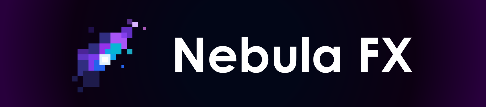

# Nebula FX

**Nebula** is a particle mod powered by a high-performance GPU-instanced rendering engine and optimized NBL streaming for fluid, large-scale animations.

### Contributing

Contributions of any kind are welcome! You can participate by:

* **Submitting Issues**: Report bugs, suggest new features, or provide feedback.
* **Submitting Pull Requests**: Fix known issues, optimize code, or improve documentation.
* **Localization**: Help us translate the mod into more languages.

Please ensure your code follows the project's coding style before submitting a PR.

### License
This project is licensed under the [GPL-v3 License](LICENSE).